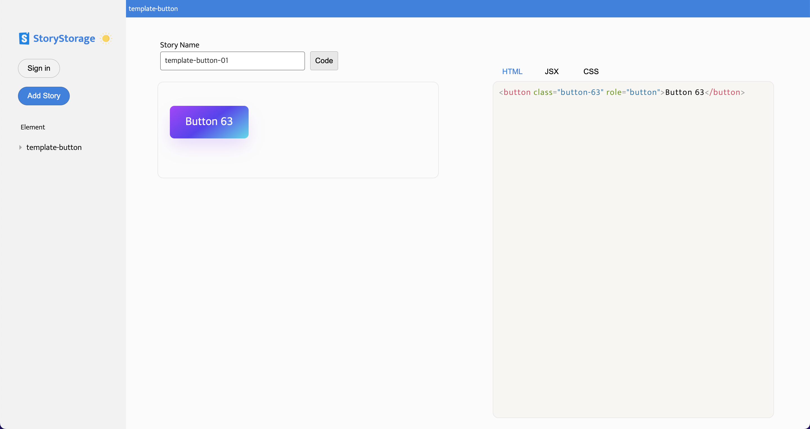
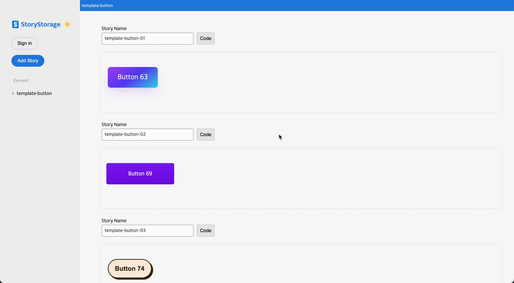
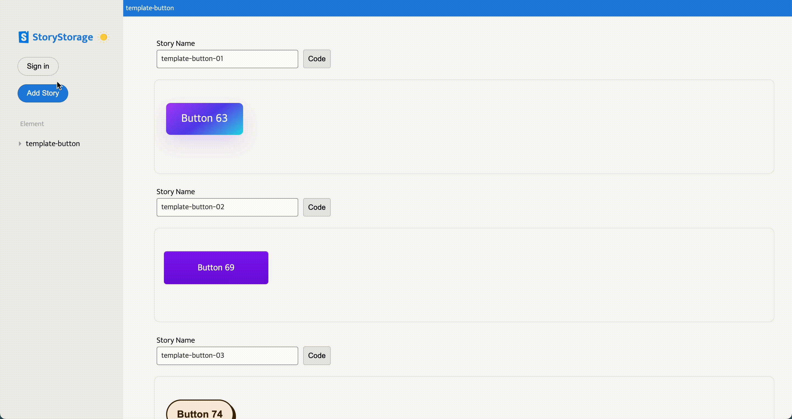
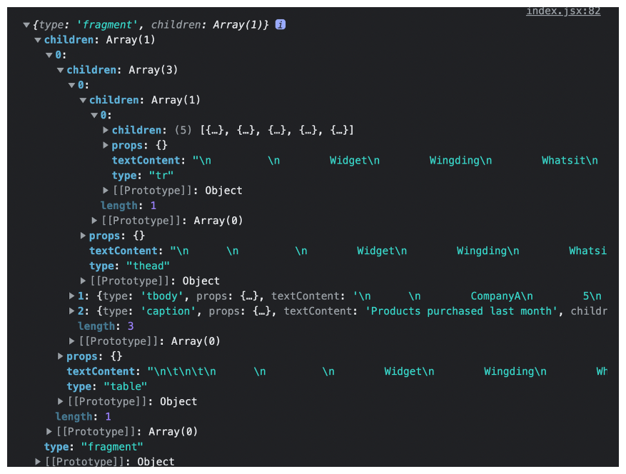
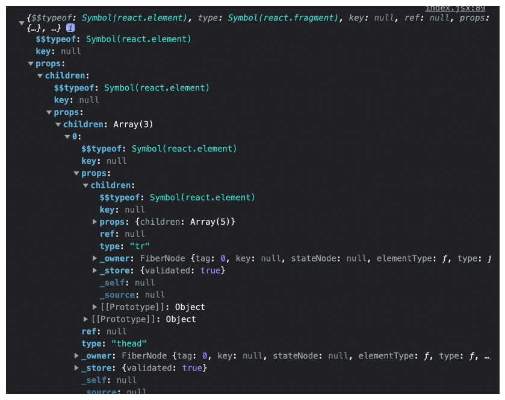

# Story Storage

<a href="https://www.storystorage.me/" target="_blank">
  
</a>

Story Storage는 독립적으로 UI를 저장할 수 있는 UI 저장소입니다.  
매번 새로 만들 필요없이 저장해놓은 UI를 간편하게 복사하여 사용할 수 있습니다.
간단하고 직관적인 인터페이스를 제공합니다.

<br />

## Layout

<details>
<summary>snapshot</summary>

<table>
  <tr align="center">
    <td>Screenshot</td>
    <td>Features</td>
  </tr>
  <tr>
    <td>
      <p>Main Page</p>
      <a href="https://github.com/story-storage-project/storystorage-client/tree/development/public/readme/snapshot-home.gif" target="_blank">
        
      </a>
    </td>
    <td>
    <ul>
      <li>public template element 버튼 리스트</li>
      <li>element 테스트 할 수 있는 기능</li>
      <li>Add Story 눌러서 테스트 할 수 기능(저장 기능은 로그인시에 가능)</li>
    </ul>
    </td>
  </tr>
    <tr>
    <td>
      <p>Login, Create Story</p>
      <a href="https://github.com/story-storage-project/storystorage-client/tree/development/public/readme/snapshot-login.gif" target="_blank">
        
      </a>
    </td>
    <td>
    <ul>
      <li>Add Story에서 html, css 코드 입력 후 생성하는 기능</li>
    </ul>
    </td>
  </tr>
  <tr>
    <td>
      <p>반응형</p>
      <a href="https://github.com/story-storage-project/storystorage-client/tree/development/public/readme/snapshot-mediaquery.gif" target="_blank">
        
      </a>
    </td>
    <td>
    </td>
  </tr>
  <tr>
    <td>
      <p>테마 변경</p>
      <a href="https://github.com/story-storage-project/storystorage-client/tree/development/public/readme/snapshot-theme.gif" target="_blank">
        
      </a>
    </td>
    <td>
    <ul>
      <li>light, dark 두 가지 버전</li>
    </ul>
    </td>
  </tr>
  <tr>
    <td>
      <p>PWD 적용</p>
      <a href="https://github.com/story-storage-project/storystorage-client/tree/development/public/readme/snapshot-pwd.gif" target="_blank">
        
      </a>
    </td>
    <td>
    <ul>
      <li>앱 저장 기능</li>
      <li>iphone에서 홈 화면 추가 -> 홈 화면에 앱 등록 기능</li>
    </ul>
    </td>
  </tr>
</table>

</details>

<br />

### Table of contents

- [Intro](https://github.com/story-storage-project/storystorage-client#story-storage)
- [Layout](https://github.com/story-storage-project/storystorage-client#layout)
- [Motivation](https://github.com/story-storage-project/storystorage-client#motivation)
- [Goal](https://github.com/story-storage-project/storystorage-client#goal)
- [Build](https://github.com/story-storage-project/storystorage-client#build)
- [Frameword](https://github.com/story-storage-project/storystorage-client#framework)
- [Installation](https://github.com/story-storage-project/storystorage-client#installation)
- [Schedule](https://github.com/story-storage-project/storystorage-client#schedule)
- [Folder structure](https://github.com/story-storage-project/storystorage-client#folder-structure)
- [Challenge](https://github.com/story-storage-project/storystorage-client#challenge)
- [Feature](https://github.com/story-storage-project/storystorage-client#feature)
- [아쉬운 점](https://github.com/story-storage-project/storystorage-client#%EC%95%84%EC%89%AC%EC%9A%B4-%EC%A0%90)

<br />

## Motivation

매번 button, input,.. 레이아웃 등 UI를 제작할 때마다 "전에 만들었던 걸 리스트로 볼 수 있다면 좋겠다." 라는 생각을 하곤 했습니다. 생각만 하지 말고 그걸 실현해보자는 마음에 이 프로젝트를 기획하게 되었습니다.
Storybook에서 컴포넌트별로 분리해서 확인할 수 있는 부분을 모티브 삼아 이름을 Story Storage라고 짓게 되었습니다.

<br />

## Goal

외부 라이브러리 없이 직접 구현하는 것이 이번 프로젝트의 가장 큰 목표였습니다.
이전 프로젝트에서 작은 기능 한 부분을 직접 구현하면서, 더 많은 배움과 새로운 시각을 얻을 수 있었습니다.  
두 번째 목표는 간편하고 직관적인 형태로 구성하고, 반응형 웹과 pwd 적용을 통해 사용자 경험을 높일 수 있게 하는 것이었습니다.

<br />

## Build

- Client: netlify
- Server: aws beanstalk (현재 일시정지 상태)
- Url: https://www.storystorage.me/

<br />

## Framework

| Frontend          | Backend      |
| ----------------- | ------------ |
| React             | Express      |
| Recoil            | jsonwebtoken |
| Styled Components | mongoose     |

<br />

## Installation

<details>
<summary>Client Installation</summary>

1. google console에서 google OAuth 2.0 클라이언트 ID를 발급받습니다.

2. 프로젝트를 다운 받은 후 프로젝트 디렉토리 내부에서 다음 명령어를 입력합니다.

```sh
npm start
```

3. 디렉토리 root 위치에 .env 파일을 생성하여 환경설정을 입력합니다.

```sh
REACT_APP_BASE_URL=<YOUR_SERVER_URL>
REACT_APP_CLIENT=<YOUR_CLIENT_URL>
REACT_APP_GOOGLE_OAUTH_CLIENT_ID=<YOUR_GOOGLE_OAUTH_CLIENT_ID>
REACT_APP_GOOGLE_OAUTH_CLIENT_SECRET=<YOUR_GOOGLE_OAUTH_CLIENT_SECRET>
REACT_APP_GOOGLE_OAUTH_ENDPOINT=<YOUR_GOOGLE_OAUTH_ENDPOINT>
REACT_APP_GOOGLE_OAUTH_REDIRECT=<YOUR_GOOGLE_OAUTH_REDIRECT>
```

4. 완료

</details>

<details>
<summary>Server Installation</summary>

```sh
npm start
```

1. https://travistidwell.com/jsencrypt/demo/ 에서 원하는 keySize를 선택한 후 키를 발급받습니다.

2. https://www.base64encode.org/ 에서 Base64 포맷으로 1번에서 발급받은 두 개의 key를 인코딩합니다.

3. 프로젝트를 다운 받은 후 프로젝트 디렉토리 내부에서 다음 명령어를 입력합니다.

```sh
npm install
```

4. 디렉토리 root 위치에 .env 파일을 생성하여 환경설정을 입력합니다.

```sh
PORT=<YOUR_SERVER_PORT>
ORIGIN=<YOUR_ORIGIN_URL>
NODE_ENV=<YOUR_NODE_ENVIRONMENT>
DB_ID=<YOUR_MONGODB_ID>
DB_NAME=<YOUR_DATABASE_NAME>
DB_PASSWORD=<YOUR_DATABASE_PASSWORD>
DB_CLUSTER=<YOUR_DATABASE_CLUSTER>

ACCESS_TOKEN_PRIVATE_KEY=<YOUR_ACCESS_TOKEN_PRIVATE_KEY>
ACCESS_TOKEN_PUBLIC_KEY=<YOUR_ACCESS_TOKEN_PUBLIC_KEY>
REFRESH_TOKEN_PRIVATE_KEY=<YOUR_REFRESH_TOKEN_PRIVATE_KEY>
REFRESH_TOKEN_PUBLIC_KEY=<YOUR_REFRESH_TOKEN_PUBLIC_KEY>

ACCESS_TOKEN_EXPIRES_IN=<YOUR_ACCESS_TOKEN_EXPIRES_IN (example 2d...)>
REFRESH_TOKEN_EXPIRES_IN=<YOUR_REFRESH_TOKEN_EXPIRES_IN (example 14d...)>

GOOGLE_OAUTH_CLIENT_ID=<YOUR_GOOGLE_OAUTH_CLIENT_ID>
GOOGLE_OAUTH_CLIENT_SECRET=<YOUR_GOOGLE_OAUTH_CLIENT_SECRET>
GOOGLE_OAUTH_REDIRECT_URL=<YOUR_GOOGLE_OAUTH_REDIRECT>
```

5. 완료

```sh
npm start
```

</details>

<br />

## Schedule

- 2022.11

- 11.07 ~ 11.09 : 아이디어 수집 및 기획
- 11.10 ~ 11.12 : 구현 가능 여부 조사, 기술 스택 검증, Mock-up(figma) 작업
- 11.13 ~ 11.14 : Mock-up(component) 작업, 레이아웃 반응형 제작
- 11.15 ~ 11.17 : 코드 에디터 제작
- 11.17 ~ 11.19 : html dom parsing 작업, 코드 에디터 보완작업
- 11.19 ~ 11.20 : 로그인 작업
- 11.21 ~ 11.24 : html 엘리먼트 수정 작업 및 리팩토링
- 11.24 ~ 11.25 : 배포
- 11.26 ~ 12.30: 리팩토링, 테스트 코드 작성

<br />

## Folder structure

<details>
<summary>Client Folder</summary>

```
Client
   ├─ components
   │  ├─ App.jsx
   │  ├─ atoms
   │  │  ├─ Button
   │  │  ├─ ImageIcon
   │  │  ├─ Input
   │  │  ├─ List
   │  │  ├─ HiddenToggleViewer
   │  │  └─ Text
   │  ├─ molecules
   │  │  ├─ Modal
   │  │  ├─ TextEditor
   │  │  ├─ Toggle
   │  │  └─ Ul
   │  ├─ organisms
   │  │  ├─ CodeEditor
   │  │  ├─ CssCodeEditor
   │  │  ├─ Footer
   │  │  ├─ HtmlCodeEditor
   │  │  ├─ LeftMenu
   │  │  ├─ PreviewStory
   │  │  └─ Story
   │  ├─ pages
   │  │  ├─ Login
   │  │  ├─ NotFound
   │  │  ├─ StoryAllPage
   │  │  ├─ StoryMaker
   │  │  └─ StoryPage
   │  ├─ templates
   │  │  └─ Layout
   │  └─ theme
   │     ├─ GlobalStyle.js
   │     └─ default.js
   ├─ constants
   │  ├─ errorMessage.js
   │  ├─ nodeTypes.js
   │  └─ webNamespaces.js
   ├─ data
   │  ├─ cssJsxProperties.js
   │  ├─ htmlElements.js
   │  ├─ htmlJsxAttributes.js
   │  └─ templates
   ├─ hooks
   │  ├─ useCssHighLightQueryText.jsx
   │  ├─ useElementCompiler.jsx
   │  ├─ useHtmlHighLightQueryText.jsx
   │  ├─ useQuery.jsx
   │  └─ useSetStyleState.jsx
   ├─ index.jsx
   ├─ service
   │  ├─ authApi.js
   │  ├─ getGoogleUrl.js
   │  ├─ http.js
   │  └─ storyApi.js
   ├─ store
   │  ├─ codeState.js
   │  └─ userState.js
   └─ utils
      ├─ codeEditor.js
      ├─ cssPropertyParser.js
      ├─ cssValidate.js
      ├─ htmlValidate.js
      ├─ insertPreviewClass.js
      ├─ keyMaker.js
      └─ stringHtmlParser.jsx

```

</details>

<details>
<summary>Server Folder</summary>

```
Server
├── constants
├── data
│   └── templates
│       └── templates.js
├── db
│   └── database.js
├── models
│   ├── Story.js
│   └── User.js
├── routes
│   ├── controller
│   │   ├── authController.js
│   │   ├── storyController.js
│   │   └── userController.js
│   ├── middleware
│   │   └── verifyAuth.js
│   ├── authRouter.js
│   ├── index.js
│   ├── storyRouter.js
│   └── userRouter.js
├── service
│   └── session.service.js
├── utils
│   ├── appErrors.js
│   └── jwt.js
├── app.js
├── config.js
└── README.md
```

</details>

<br />

## Challenge

### Atomic Design 적용

아토믹 디자인을 도입하게 된 이유도 이 프로젝트의 목적인 '재사용'과 연관 지어 결정하게 되었습니다.
atom ~ page까지의 다섯 가지 분류를 모두 적용해 보면서 아토믹 디자인이 어떤 것인지 익혀보려 하였습니다.

<br />

> 느낀 점

<br />

1. 초반 설계의 중요성

- 기준이 명확한 디자인 설계가 굉장히 중요하다는 것을 배웠습니다. 패턴을 나누는 기준이 명확하지 않아 초반에 설계할 때 많은 시간을 쓰게 되었는데 이때 시간을 쓰지 않았더라면 후에 수정하려 할 때 많은 복잡도가 요구될 것 같다는 생각이 들었습니다.

2. 폴더 분류의 기준

- 디자인 패턴을 적용하기 전에는 패턴이라는 것이 명확하게 정해져 있는 것으로 생각했지만 조금 더 알아보고 사용해보니 패턴이라는 것은 틀만 주어지고 그것을 어떻게 응용하느냐에 따라 다른 결과를 낼 수 있다는 걸 알게 되었습니다. 그러다 보니 제가 적용한 방법이 옳은 것인지 탐구하는 시간을 많이 가지게 되었습니다. 특히 `molecules`와 `organisms`을 구분할 때 모호함을 많이 느끼게 되어 많은 고민을 하게 되었는데, 다른 글들을 참고하여 구분하는 기준을 컨텍스트의 유무로 나누어 분류하였습니다. 처음에는 폴더 분류가 익숙하지 않았지만, 시간이 지날수록 커스텀화하여 쓸 수 있다는 점이 큰 장점으로 와 닿았습니다.

3. 장점

- 적용 후 시간이 지날수록 많은 장점을 느끼게 되었습니다.
  이전에 components 폴더 안에 모든 컴포넌트를 한 번에 넣어놓고 작업했던 것 보다 원하는 컴포넌트를 찾기에 효율적이었습니다. 처음엔 명시적이지 않던 폴더의 이름들이 적응 후에는 이름 자체가 모듈의 크기로 느껴져 더 명시적이고 뚜렷한 느낌을 받게 되었습니다.

---

### Google oauth jwt 토큰 로그인 적용

firebase 등 npm 설치 없이 로그인을 적용할 방법을 알아보던 중 passport 라이브러리 없이 적용하는 방법을 알게되어 적용해보게 되었습니다.

<br />

> 구현 방법

<br />

1. 클라이언트에서 로그인 버튼을 누르면 구글 인가 서버 url로 접속합니다.

```js
// google auth url
const getGoogleUrl = from => {
  const rootUrl = `https://accounts.google.com/o/oauth2/v2/auth`;

  const options = {
    redirect_uri: config.googleOauth.redirect,
    client_id: config.googleOauth.clientId,
    access_type: 'offline',
    response_type: 'code',
    prompt: 'consent',
    scope: [
      'https://www.googleapis.com/auth/userinfo.profile',
      'https://www.googleapis.com/auth/userinfo.email',
    ].join(' '),
    state: from,
  };

  const qs = new URLSearchParams(options);

  return `${rootUrl}?${qs.toString()}`;
};
```

2. redirect url로 등록한 서버의 주소로 get 요청이 들어오면 서버에서 request의 code를 받아 서버에서 code와 client id, secret, grant_type 등 옵션을 넣어 oauth2.googleapis 서버로 직접 post 요청을 보냅니다. 인증을 받게되면 id token과 access token을 얻습니다.

3. access token이 포함된 주소로 요청을 보내 유저 정보를 받고 가입이 되어 있지 않으면 유저를 등록합니다.

4. 서버만 가지고 있는 access token의 private key, refresh token의 private key를 이용하여 각각의 jwt 토큰을 만들어 response에 cookie를 설정하고 client의 주소로 redirect 응답을 보냅니다.

5. 클라이언트의 요청마다 cookie에 저장되어 있는 access token을 서버의 access token public key로 검증합니다.

6. 유저에게 등록된 access token의 만료기간이 끝나고 refresh token만이 남아있을 경우 클라이언트에서 요청시 요청을 우회하여 refresh 토큰을 검증하는 서버로 요청을 보낸 후 다시 access token을 발급 받고 처리하지 못했던 클라이언트 요청을 처리합니다.

```js
const API = axios.create({...});

API.interceptors.response.use(
  res => {
    ...
  },

  error => {
    ...
    if (response && response.status === 401) {
      const originalRequest = reqConfig;

      try {
        const data = await axios.get(`${baseURL}/auth/refresh`, {
          withCredentials: true,
        });

        if (data.result === 'success') {

          return axios(originalRequest);
        }
      } catch (err) {
        throw currentError;
      }
    }
```

axios의 interceptors를 이용하여 error status code가 401일 경우 요청을 우회하여 refresh 토큰을 검증하는 서버로 요청을 보낸 후 성공 메시지를 받게 되면 다시 처리하지 못했던 요청을 처리해주었습니다.

<br />

> 이슈

<br />

- 배포 시 쿠키가 클라이언트에 등록되지 않는 이슈
- 네트워크 탭에는 request, response 모두 쿠키가 담겨 있지만 어플리케이션에서 쿠키탭을 확인하면 쿠키가 적용되지 않는 이슈가 있었습니다. 이는 배포 후에 사이트가 https가 적용되어 설정했던 secure 옵션이 바로 적용되지 않은 점, cookie에 domain 설정이 되어있지 않았던 점이 문제로 작용하였습니다.

  ```js
  const httpsOption =
    config.nodeEnv === 'production'
      ? {
          secure: true,
          domain: 'storystorage.me',
        }
      : {};
  ```

  배포 사이트와 로컬 사이트 둘 다 테스트하기 위해서 cookie에 들어갈 옵션 중 https용 쿠키 옵션을 따로 빼서 환경 설정에 따라 적용되도록 해주었습니다.

<br />

> 느낀 점

<br />

- 로그인 과정을 진행하면서 전에 사용했던 passport 라이브러리에서 헷갈렸던 부분들을 정리할 기회가 되었습니다. 그와 더불어 어렵게만 느껴졌던 passport라는 라이브러리가 따로 서버에서 처리해줘야 복잡한 요청을 두 개의 라우트와 strategy 설정을 통해서 관리하기 쉽게 해준다는 것을 깨닫게 되었습니다. 어떠한 과정으로 로그인이 진행되는지 직접 해보고 나니 그전엔 로그인되는 과정을 모른 채 라이브러리의 사용법만을 알려고 노력했기 때문에 어려웠다는 걸 알게 되었습니다. 라이브러리의 사용법보다는 과정을 이해하려 한다면 라이브러리를 좀 더 쉽게 사용할 수 있을 거라는 생각을 하게 된 계기가 되었습니다.

### StoryBook 적용

- 아토믹 디자인과 함께 적용해보고 싶었던 storybook을 적용해보았습니다.

### Test Lines coverage 90프로 이상

|                  | File      | Stmts | Branch | Funcs | Lines |
| ---------------- | --------- | ----- | ------ | ----- | ----- |
| Client Unit Test | All files | 93.03 | 87.94  | 90.44 | 93.78 |
| Server Unit Test | All files | 99.24 | 82.64  | 75.58 | 99.24 |

<br />

## Feature

### 코드 에디터 제작

엘리먼트를 등록하기 위해서는 html(+ jsx), css 코드 에디터가 필요했습니다. 처음에 생각한 선택지는 code mirror, markdown code editor를 생각했지만 제가 구현하고자 했던 에디터는 javascript처럼 특별한 연산이 필요한 작업이 아니었기 때문에 라이브러리 없이 구현할 수 있지 않을까라는 생각에, 앞서 생각했던 선택지를 배제하게 되었습니다. textarea 위에 div를 얹을 수 있을 것 같다는 생각이 들어 textarea와 div를 이용해서 구현하게 되었습니다.

<br />

> 구현 기능

<br />

1. vscode처럼 `<div>`, `{` 태그를 입력하면 자동으로 닫힘태그가 입력되는 기능

- onKeyDown을 이용해 글자를 체크하여 구현하였습니다. 끝 괄호를 체크하여 괄호를 만들고 커서가 텍스트 중간에 있어도 위치가 잘 유지되기 위해서 caretPosition을 이용해 앞의 text와 뒤 text를 분리하여 합쳐주는 작업을 하였습니다.

2. vscode와 같은 tab 기능

- textarea에서 텍스트의 위치를 조절하는 부분이 생각보다 까다로웠습니다. tab 기능을 추가하기 위해서는 커서의 위치뿐 아니라 뒤의 text 유무까지 파악해야 했기 때문에 위의 방법처럼 앞의 text와 뒤의 text를 caret의 위치로 나눈 후 그 사이에 `/t`을 삽입해주었습니다.
- 문자열 중간에 `/t`만을 삽입하는 것이 아닌 문자열을 둘로 나눠 모든 문자열을 반환하는 작업을 해주었기 때문에 caret은 그 즉시 위치값이 없어지게 되어 삽입 전에 caret의 위치값을 저장하고, 삽입 후 caret의 위치까지 올바른 위치로 가게 해주는 작업까지 함께 해주었습니다.

3. 태그 이름, 어트리뷰트 이름별로 하이라이트 색깔이 달라지는 기능

- 이 기능을 추가하기 위해서 많은 라이브러리를 찾아보게 되었습니다. 다른 에디터를 개발자 도구로 확인하던 중 모든 엘리먼트들이 span으로 나뉘어있는 것을 보게 되었습니다. 거기서 힌트를 얻어 span 태그를 이용한 작업을 하게 되었습니다. textarea의 value를 얻어 그것을 `code.split(/(<!--| |-->|<|>)/)` 주석, 공백, 괄호 등으로 나눠 `split`해준 후 `map`을 돌면서 각각의 text에 맞는 span태그를 지정하여 렌더링 해주었습니다. html, jsx, css attributes, value data를 저장하여 map을 돌면서 맞는 attribute인지 확인해주는 작업을 추가하여 잘못된 경우에는 밑줄이 쳐진 span 태그를 리턴하도록 해주었습니다.
- 조건문의 개수가 많아지게 되어 `useHtmlHighLightQueryText`라는 custom hook을 만들게 되었습니다.
  `const [htmlCode, queryHtml, setQueryHtml] = useHtmlHighLightQueryText(htmlData);` queryHtml에는 span 엘리먼트의 값이 들어있습니다. 컴포넌트의 return문 안에 위치하여 값으로 작용하도록 해주었습니다. setQueryHtml는 span을 만드는 함수가 담겨있습니다. onKeyDown 이벤트 함수안에 넣어 키가 입력될 때 실행되도록 해주었습니다.

<br />

> 느낀 점

<br />

- 코드 에디터의 기능이 생각보다 수작업으로 해야 하는 작업이 많다는 걸 느끼게 되었습니다. 하나씩 비교를 해주어야 하는 부분이 많아 조건문의 개수가 많아져 코드의 가독성이 점점 떨어지게 되었는데, 이 부분을 잘 모듈화하여 포장하는 작업을 잘하질 못한 것 같아 아쉬웠습니다.
  기능 구현 부분에서 시간을 많이 쏟게 되어 렌더링 최적화에 대해 많은 신경을 쓰지 못한 점도 아쉬운 부분이 많습니다. 지금의 구현 방법으로는 텍스트를 입력할 때마다 계속 새로운 span태그가 생성되어 텍스트의 양이 많아질 때는 굉장히 느려지는 이슈가 있습니다. 이 방법을 보완하기 위해서 어떻게 개선해야 할지 렌더링 최적화와 같이 고민해보고 리팩토링 해보려합니다.

---

### string html to dom

string html을 dom으로 바꾸는 작업을 해주었습니다. 처음의 접근 방법은 `innerHTML`을 사용하고자 했습니다. React에서 `innerHTML`을 사용하기 위해서는 `dangerouslySetInnerHTML` 태그를 사용해야 하지만

```
<div>
  <textarea value="" />
  <button></button>
</div>
```

이러한 값을 넣었을 때 button이 textarea의 value 자체로 인식되는 등의 이슈가 생겨 저 태그가 아닌 DOMParser api를 사용하여 string을 dom으로 만드는 작업을 해주었습니다.

코드 에디터에서 값이 입력되고 올바른 값인지 체크 후 `new DOMParser()`을 이용해 parser를 만든 후 `parseFromString` 메서드를 이용해 dom 엘리먼트로 변환하여 Node Lists를 얻었습니다.

노드 하나 하나의 정보를 저장하기 위해서 1차 가공작업을 하였습니다. 노드 리스트는 트리 형태로 되어 있기 때문에 재귀 함수를 만들어 자식 노드들을 다 거치게 하였습니다.
(노드 리스트는 배열이 아닌 유사 배열 객체라서 `Array.from...call`을 사용하였습니다.)

`React.createElement(component, props, ...children)`  
react createElement는 위와 같은 형태를 가지기 때문에 props라는 빈 객체를 만들어 수집한 데이터를 넣어주었고, node type을 체크하여 childNodes가 없을 때까지 노드의 attribute와 textcontent를 수집합니다. props 객체를 노드마다 만들어주면서 수집한 데이터를 안에 넣어주었습니다.

  
1차 가공후의 모습입니다.  
이렇게 정보를 중첩하여 저장한 후 element를 만들어 주는 재귀함수를 실행시킵니다.

```js
import { createElement, Fragment } from 'react';

export default function useElementCompiler(data) {
  if (!data) return;

  const child = Array.isArray(data.children)
    ? data.children.map(item => useElementCompiler(item)).filter(Boolean)
    : data.children;

  if (Array.isArray(child)) {
    return createElement(
      data.type === 'fragment' ? Fragment : data.type,
      data.props,
      ...child,
    );
  }

  return createElement(data.type, data.props, data.children);
}
```

모든 데이터의 취상위 루트를 fragment로 감싸주어 최상위 노드가 여러 개일 경우 발생할 수 있는 이슈를 방지해주고자 하였습니다.

<br />

> 느낀 점

<br />

- 태그를 작성하는 것이 아닌 함수를 만들어 가공하는 작업을 거친 후 만든다는 게 직관적이지 않고 눈에 보이는 작업이 아니라서 어려운 부분이 있었습니다. 많은 라이브러리를 참고하면서 처음엔 1차, 2차 가공이 아닌 처음 시작부터 createElement를 호출하면서 작업하였습니다. 그러다 보니 중간에 오류가 나게 되면 어느 부분에서 문제가 생겼는지 확인하기 쉽지가 않았습니다. 더 알아보니 리액트의 태그를 콘솔에 출력해보면 객체를 반환한다는 것을 알 수 있었습니다.
  
  이 데이터를 확인하고 나서 저도 이것처럼 데이터를 가공하면 좀 더 눈으로 확인할 수 있는 데이터를 만들 수 있겠다는 생각에 1차, 2차 가공으로 나누게 되었습니다.

---

### 스타일 적용

css를 적용하는 부분은 처음에는 React inline style을 계획하였습니다. 하지만 inline style은 hover, focus등 의사클래스를 지원하지 않는다는 부분을 알게 되어 방향을 수정하였습니다. 그다음 접근 방향으로는 새로운 CSSStyleSheet를 만들어 새로운 rule을 주입해 만들어주는 방법으로 접근해보려 하였습니다. 이 방향으로 알아보던 중 head에 style태그를 만들어서 innerHTML을 이용한 방법을 알게 되어 이 방법을 선택하여 진행하게 되었습니다.

<br />

> 느낀 점

<br />

- styled components 또는 emotion 등 css in js 라이브러리들이 CSSOM을 직접 조작하며 스타일을 적용한다는 걸 알게 된 좋은 계기가 되었습니다. 리팩토링 시 계획했던 CSSStyleSheet에 rule을 주입하는 방법으로 다시 리팩토링 해보고 싶습니다.

<br />

## 아쉬운 점

- 이번 프로젝트를 진행하면서 parsing을 하는 작업을 많이 거치게 되었습니다. 그러다 보니 코드가 길어지게 되면서 코드의 모듈화가 필요하다는 것을 절실히 느꼈습니다. 최대한 모듈화하고 가독성 좋게 만들어 보려 했지만, 아직 부족한 부분이 많고 만족스러운 코드가 되지 않은 것 같아 아쉬운 마음이 듭니다. 코드를 작성하면서 어떤 것을 더 공부해야 더 재사용하기 쉽고 보기 좋은 코드를 만들어낼 수 있는지 많은 궁금증이 들었고 답답한 마음이 많이 들게 되었습니다. 이번 프로젝트를 통해서 깨달았던 것들과 궁금했던 부분을 정리하여 더 좋은 코드로 리팩토링 해보고자 합니다.

<br />

## 프로젝트를 통해 배운 점

- 기초가 중요하다는 점을 또 한 번 느끼게 되었습니다. string을 DOM으로 바꾸면서 DOM에 대한 이해가 많이 필요했는데 node마다 type이 있고 html과 svg는 name space가 달라 parsing하는 과정을 html과 다르게 해주어야 한다는 것도 알게 되었습니다.
- 이번 프로젝트를 통해 라이브러리 코드를 보는 과정을 많이 겪으면서 라이브러리를 만든 분들에 대한 생각이 달라지는 계기가 되었습니다. 그저 적용만 했을 때보다 코드를 보며 스스로 만들어보는 과정을 겪게 되니 라이브러리를 만든 분들이 대단하다는 생각을 많이 했던 것 같습니다. 그리고 전에는 새로운 라이브러리를 보고 적용해보고 싶다는 생각이 많이 들었다면, 이제는 어떻게 만들었는지 코드가 궁금해진다는 생각이 먼저 들게 되었고, 저도 더 좋은 코드를 작성해서 공유할 수 있는 개발자가 되고 싶다는 목표가 생겼습니다.

<br />

## Creator

- 임현정 glowhyun1@gmail.com
